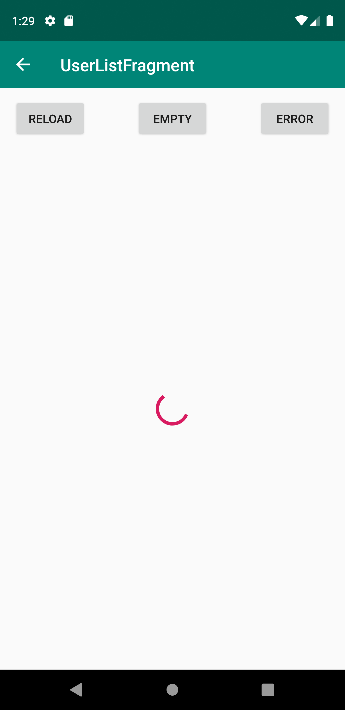
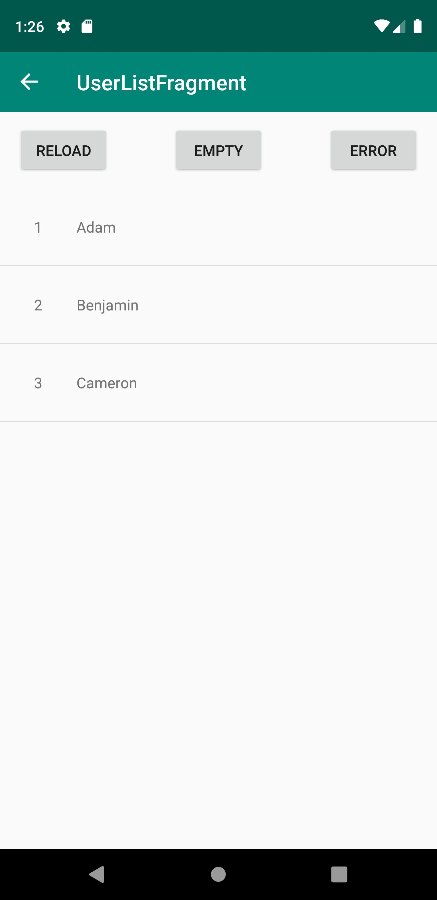
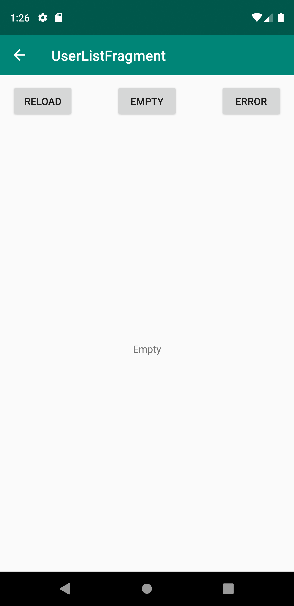
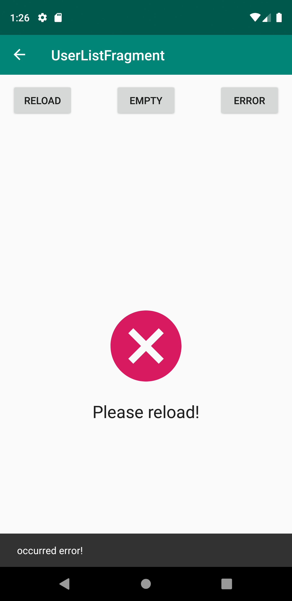

# android-mvrx-example

## Overview

This is a sample of a ListView using Airbnb MvRx & Airbnb Epoxy.

### Loading

### Load completed

### Empty List

### Load Error

## Using Components

It uses the following components:

- Airbnb MvRx
- Airbnb Epoxy
- Dagger2
- Square assisted-inject
- Android Navigation Architecture Component
- Android Architecture Components(ViewModel, LiveData)
